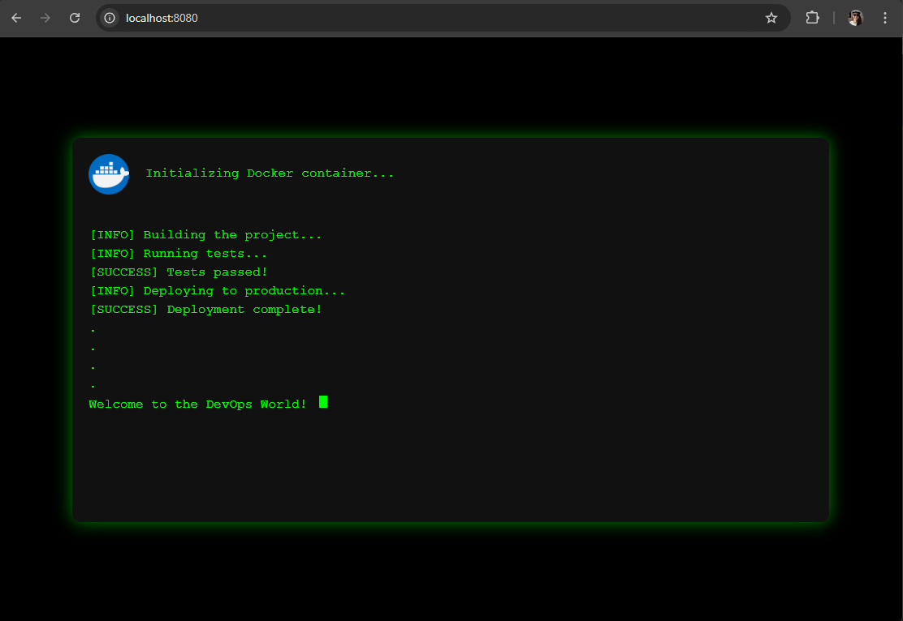

# site-nginx-docker
Este projeto, desenvolvido como parte da disciplina de Culturas e Práticas DevOps do curso de pós graduação em Arquitetura de sistemas distribuidos. Consiste em uma aplicação web simples utilizando HTML puro, configurada para ser executada dentro de um container Docker usando Nginx.


## Estrutura do Projeto

- **Dockerfile**: Define a imagem base do Docker e copia o arquivo HTML para o diretório apropriado.
```dockerfile
FROM nginx:latest
COPY arquivo.html /usr/share/nginx/html/index.html
EXPOSE 80
```
- **arquivo.html**: Contém o código HTML que será servido pelo Nginx.

## Pré-requisitos
- Docker instalado na máquina host.

## Instruções para Construção e Execução

1. Construir a Imagem Docker:
```bash
docker build -t site-nginx-docker:v1 .
```

Este comando constrói a imagem Docker a partir do Dockerfile, marcando-a como site-nginx-docker com a tag v1.

2. Executar o Container:
```bash
docker run -d -p 8080:80 site-nginx-docker:v1
```

Este comando inicia o container em segundo plano, mapeando a porta 80 do container para a porta 8080 do host.

3. Verificar o Status do Container:
```bash
docker container ps
```

Este comando lista os containers em execução, permitindo verificar se o **site-nginx-docker** está ativo.

## Acessando a Aplicação
Após executar o container, a aplicação estará disponível no navegador através do endereço http://localhost:8080.

<p align="center">
  
</p>
